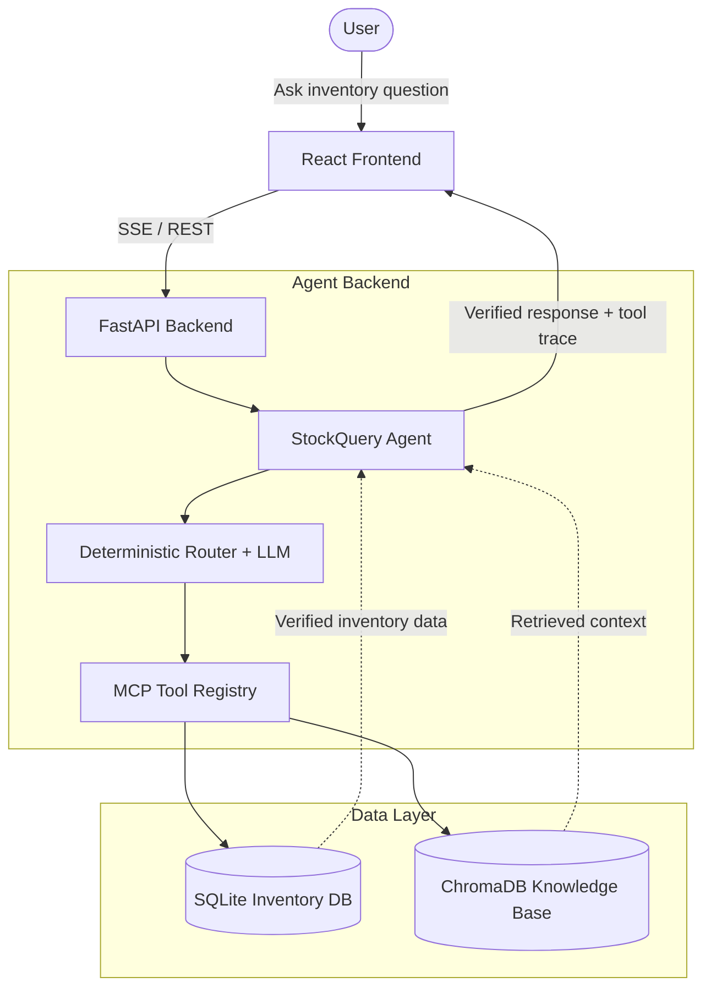

# StockQuery AI: Inventory Intelligence Agent

StockQuery AI is a full-stack retail inventory assistant that answers questions from verified data instead of guessing. The frontend provides a dashboard, chat assistant, product management, low-stock alerts, and order tracking. The backend uses FastAPI, SQLite, ChromaDB, and an MCP-compatible tool layer so the agent can query structured systems before responding.

## Overview

This project demonstrates an agentic workflow for retail operations:

- A user asks an inventory question in the React app.
- The FastAPI backend routes the request to verified tools.
- Tools query SQLite or the knowledge base.
- The agent responds only from returned results.
- The UI shows tool traces so the answer is explainable.

For common inventory questions, the backend can deterministically route straight to the right tool without waiting on model reasoning. If the LLM is unavailable, the app still falls back to safe verified responses where possible.

## Key Features

- Verified chat answers backed by SQLite inventory data
- Visible tool traces in the chat interface
- Dashboard with live inventory stats and charts
- Product catalog search plus create, update, and delete flows
- Low-stock alerts with one-click restock order creation
- Purchase order tracking with status updates
- MCP JSON-RPC endpoint for tool discovery and execution
- Optional ChromaDB knowledge-base retrieval
- Firebase authentication for protected frontend routes

## Tech Stack

- Frontend: React, Vite, TypeScript, Tailwind CSS, shadcn/ui, Recharts
- Backend: FastAPI, Python, SQLite, ChromaDB
- Agent layer: OpenAI-compatible client, MCP tool registry, deterministic routing
- Authentication: Firebase
- Local model runtime: Ollama with `qwen2.5:1.5b` by default

## Architecture



## What The App Includes

### Frontend pages

- Dashboard: inventory KPIs, category value chart, and inventory breakdown
- Chat: verified assistant responses streamed over SSE with tool status cards
- Products: searchable catalog with add, edit, and delete actions
- Alerts: low-stock monitor with estimated restock cost and quick reorder actions
- Orders: purchase order history with pending and arrived states

### Backend capabilities

- Streaming chat endpoint at `/api/chat/stream`
- Non-streaming chat endpoint at `/api/chat`
- Inventory stats, product CRUD, alerts, and order APIs
- MCP endpoint at `/mcp`
- Knowledge ingestion endpoint at `/api/knowledge/ingest`
- Session-based chat history with verified result reuse

## Supported Verified Queries

Try prompts like:

- `Show all products`
- `What is the cheapest product?`
- `What is our total inventory value?`
- `Give me an inventory overview`
- `Show low stock items below 5`
- `Which items are out of stock?`
- `Show Logitech products`
- `What categories do we have?`
- `Tell me about Test Laptop`
- `Show pending orders`
- `Do you have milk?`

The backend currently supports verified intents for:

- product availability
- product details
- low-stock and out-of-stock checks
- category-based listing
- broad catalog search
- cheapest-product lookup
- total inventory value
- inventory overview
- order listing and order status filtering
- knowledge-base search

## Project Structure

```text
StockQueryAI/
|-- src/                    # React frontend
|-- public/                 # Static assets
|-- ai_agent_backend/       # FastAPI app, SQLite tools, MCP server
|-- README.md               # Top-level project guide
|-- test_api.py             # Simple API smoke test
```

For backend-specific API details, see [`ai_agent_backend/README.md`](./ai_agent_backend/README.md).

## Local Development Setup

### 1. Start the local LLM

Agent features are designed around an OpenAI-compatible endpoint. The default configuration expects Ollama:

```bash
ollama pull qwen2.5:1.5b
ollama serve
```

If you prefer another compatible provider, update `ai_agent_backend/.env` instead.

### 2. Start the backend

Run these commands from the project root:

```powershell
cd ai_agent_backend
python -m venv .venv
.venv\Scripts\Activate.ps1
pip install -r requirements.txt
Copy-Item .env.example .env
python seed.py
uvicorn main:app --reload --port 8000
```

On macOS or Linux:

```bash
cd ai_agent_backend
python -m venv .venv
source .venv/bin/activate
pip install -r requirements.txt
cp .env.example .env
python seed.py
uvicorn main:app --reload --port 8000
```

Notes:

- Run the backend from `ai_agent_backend` unless you switch the relative paths in `.env` to absolute paths.
- `python seed.py` resets and seeds the demo SQLite inventory.
- Swagger UI is available at `http://127.0.0.1:8000/docs`.

### 3. Start the frontend

Open a second terminal in the project root:

```powershell
Copy-Item .env.example .env.local
npm install
npm run dev
```

If PowerShell blocks `npm.ps1`, use:

```powershell
npm.cmd install
npm.cmd run dev
```

The frontend runs on Vite's default local port, usually `http://localhost:5173`.

### 4. Configure the frontend API base if needed

The root `.env.example` contains:

```env
VITE_API_BASE=http://localhost:8000
```

If you start FastAPI on `8001`, update `.env.local` to:

```env
VITE_API_BASE=http://localhost:8001
```

## Environment Notes

### Frontend

- `VITE_API_BASE` controls where the React app sends API requests.
- Firebase is currently configured directly in `src/lib/firebase.ts`.

### Backend

Important backend variables from `ai_agent_backend/.env.example`:

- `STOCKQUERY_DB_PATH`: SQLite database path
- `STOCKQUERY_CHROMA_PATH`: ChromaDB persistence path
- `OPENAI_BASE_URL`: OpenAI-compatible endpoint
- `OPENAI_API_KEY`: API key for that endpoint
- `STOCKQUERY_LLM_MODEL`: default chat model
- `STOCKQUERY_LLM_TIMEOUT_SECONDS`: timeout before safe fallback
- `STOCKQUERY_LOW_STOCK_THRESHOLD`: default restock threshold
- `STOCKQUERY_SESSION_HISTORY_LIMIT`: chat memory depth
- `STOCKQUERY_CORS_ORIGINS`: allowed frontend origins

## Useful Endpoints

### Chat and agent

- `POST /api/chat`
- `POST /api/chat/stream`
- `DELETE /api/chat/session`
- `GET /api/tools`
- `POST /mcp`

### Inventory operations

- `GET /api/dashboard/stats`
- `GET /api/products`
- `POST /api/products`
- `PUT /api/products/{product_id}`
- `DELETE /api/products/{product_id}`
- `GET /api/alerts`
- `GET /api/orders`
- `POST /api/orders`
- `PUT /api/orders/{order_id}/status`

## Testing

Frontend:

```bash
npm test
```

Backend:

```bash
cd ai_agent_backend
pytest test_backend.py
```

Simple API smoke test with the backend running:

```bash
python test_api.py
```

## Screenshots

Add these screenshots before submission:

- `docs/screenshots/dashboard.png`
- `docs/screenshots/chat-tool-trace.png`
- `docs/screenshots/products.png`
- `docs/screenshots/orders-or-alerts.png`

Suggested captures:

- dashboard overview with charts
- chat response showing at least one verified tool trace
- products table with CRUD controls visible
- either the orders page or the alerts page

## Why This Project Matters

StockQuery AI shows a practical agent pattern: the model is not trusted to invent answers, only to decide when and how to use tools. That makes the system more auditable, more reliable for operations use cases, and easier to explain in demos or submissions.
